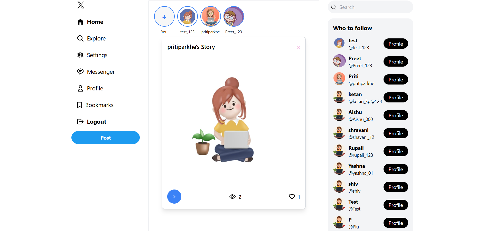

# Twitter Clone

A full-stack Twitter clone built with the **MERN Stack** (MongoDB, Express.js, React.js, Node.js), providing core features such as user authentication, tweet creation, real-time chat, and media handling. This project demonstrates how to build a social media platform with modern web technologies.

## 🚀 Demo

Check out the live demo: [View Demo](https://twitter-fullstack-nn97.vercel.app)


# Features

- **User Authentication**: Secure sign-up, login, and JWT-based session management.
- **Tweet Creation**: Users can create, like, comment, and delete tweets.
- **Real-Time Chat**: Chat with friends and followers in real-time using **Socket.io**.
- **Story Feature**: Post and view stories with media (images/videos).
- **Follow/Unfollow**: Follow and unfollow other users to see their tweets.
- **User Profiles**: View and update profile details, including the ability to upload a profile picture.
- **Responsive Design**: Mobile-first approach for seamless usage across devices.
- **Real-Time Notifications**: Get notified for new tweets, likes, and messages.

# Tech Stack

- **Frontend**: 
  - **React.js** with **Hooks** for building the UI.
  - **Redux** for state management.
  - **Tailwind CSS** for styling and responsive design.
  - **Socket.io** for real-time chat functionality.
  
- **Backend**: 
  - **Node.js** and **Express.js** for API development.
  - **MongoDB** for database storage.
  - **JWT** for secure user authentication.
  - **Cloudinary** for media (images/videos) storage.

## Installation

### Clone the repository

```bash
git clone https://github.com/PritiParkhe/Twitter-Fullstack

### Install dependencies

#### Backend

```bash
cd backend
npm install
```

#### Frontend

```bash
cd frontend
npm install
```

### Set up environment variables

Create a `.env` file in the **backend** directory and add the following:

```bash
MONGO_URI=your_mongodb_connection_string
JWT_SECRET=your_jwt_secret_key
CLOUDINARY_URL=your_cloudinary_url
PORT=5000
```

### Running the application

#### Backend

In the **backend** folder:

```bash
npm start
```

This will start the backend server on **http://localhost:5000**.

#### Frontend

In the **frontend** folder:

```bash
npm start
```

This will start the frontend on **http://localhost:3000**.

## Usage

1. **Sign Up / Log In**: Register a new user or log in with existing credentials.
2. **Create Tweet**: Write tweets and share them with your followers.
3. **Follow Users**: Follow users and view their tweets in your feed.
4. **Like / Comment on Tweets**: Engage with others by liking or commenting on tweets.
5. **Real-Time Chat**: Start chatting with other users in real-time.
6. **Post Stories**: Upload and view stories from people you follow.
7. **Notifications**: Receive notifications for new tweets, likes, and messages.

## Screenshots

### Home Page


### User Profile


### User Profile


### Story Feature



### Chat Feature


### Mobile view


## Roadmap

- Add **Search** functionality to find users and tweets.
- Implement **Direct Messaging** to allow private conversations.
- Integrate **Video Support** for tweets and stories.
- **Improve UI/UX** for a better user experience.
- Add **Trending Tweets** and a **Hashtag** feature.

## Contributing

Contributions are welcome! If you find a bug or want to add a feature, feel free to open an issue or submit a pull request. 

1. Fork the repository.
2. Create a new branch (`git checkout -b feature/your-feature`).
3. Commit your changes (`git commit -am 'Add new feature'`).
4. Push to the branch (`git push origin feature/your-feature`).
5. Create a new pull request.

## License

This project is licensed under the MIT License - see the [LICENSE](LICENSE) file for details.
